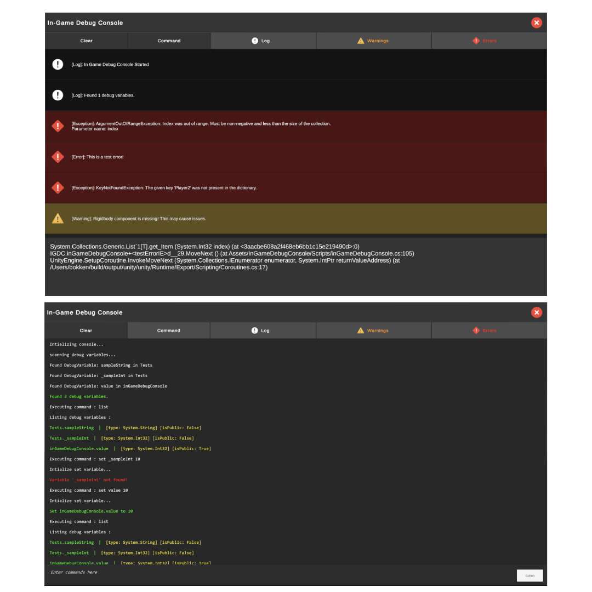

# In-Game Debug Console for Unity

An **In-Game Debug Console** for Unity that allows real-time logging, filtering, and executing commands during runtime. This tool helps developers and testers debug their games while running on any platform without relying on the Unity Editor Console.

## Features

- **In-Game Log Viewer**: Displays logs, warnings, and errors in a UI panel.
- **Filtering System**: Toggle between logs, warnings, and errors for easy debugging.
- **Command Execution**: Run commands directly from the console.
- **Debug Variable Inspection**: Automatically detects and displays script variables marked with `[DebugVariable]`.
- **Clear Logs**: Remove all logs with a single button.
- **Toggle Console**: Open and close the console via UI or a keybind.
- **Setup Wizard**: Easily configure the debug console in the Unity Editor.

## Installation

### Download & Install

1. Download the latest `.unitypackage` from the **Releases** section on GitHub.
2. In Unity, go to `Assets > Import Package > Custom Package` and select the downloaded `.unitypackage`.
3. Import all necessary files.

### Adding the Debug Console

1. Open the **Setup Wizard** (`Tools > In-Game Debug Console Setup`).
2. Choose one of the following options:
   - **Enable Automatic Canvas Creation**: Creates a new canvas dedicated to the debug console.
   - **Assign Existing Canvas**: Select an existing canvas in the scene for the debug console.
3. Select a UI button to open/close the console.
4. Click **Apply Settings** to finalize the setup.

## Usage

### Opening the Console

- Use the assigned UI button to open the console.

### Logging Messages

Use Unity's built-in logging methods:

```csharp
Debug.Log("This is a log message");
Debug.LogWarning("This is a warning message");
Debug.LogError("This is an error message");
```

### Filtering Logs

- Click on the **Log**, **Warning**, or **Error** buttons to filter messages.

### Clearing Logs

- Click the **Clear** button to remove all logs from the display.

### Running Commands

1. Enter a command in the text field and press Enter.
2. The console will execute the command if it matches a valid function.
3. Enter the command 'help' to get a list of all available commands.
4. Key commands include 'list' and 'set' which allows the users to list all the variables marked with [DebugVariable] attribute and change their values at runtime using the 'set' command.

### Debug Variables

To expose script variables for runtime modification, mark them with the [DebugVariable] attribute:

```csharp
public class Player : MonoBehaviour {
    [DebugVariable]
    public float speed = 5.0f;
}
```

These variables can then be viewed and modified from the console.

## Customization

- Modify the UI in the Unity Editor to match your project’s design.
- Adjust keybinds for opening/closing the console in the `inGameDebugConsole.cs` script.
- Configure settings using the **Setup Wizard**.

## Contributing

Pull requests are welcome! If you have suggestions or want to improve the console, feel free to contribute.

## License

This project is open-source under the **Apache 2.0 License**.

## Development Status

This project is still under development, and new features will be added soon!

For any issues, feel free to open a GitHub issue or reach out!
